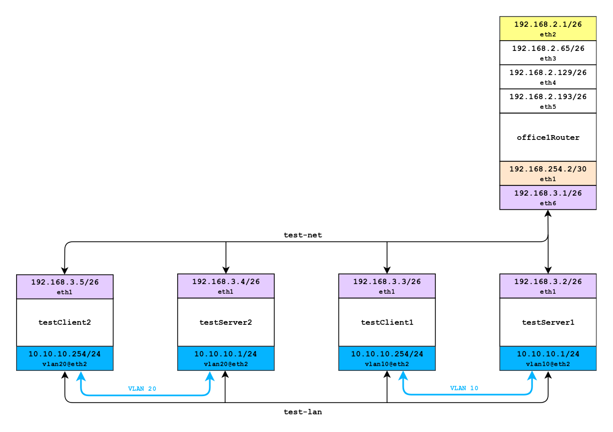
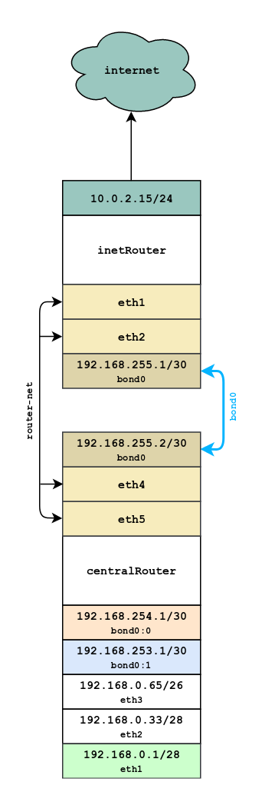

# Homework 10

## Сетевые пакеты. VLAN'ы. LACP.
-------------
Vagrantfile для задания: [Vagrantfile](./Vagrantfile)
### Развести вланами:
```
testClient1 <-> testServer1
testClient2 <-> testServer2
```
В общую сеть были добавлены 4 хоста. Общая карта сети доступна [здесь](./hw10-full-map.png).

Схема для задания:
<a href="https://raw.githubusercontent.com/reddare/otus-linux/hw10/hw10/hw10-vlan.png" rel="Click!"></a>

Доступ к хостам для проверки можно получить через:
```
vagrant ssh testServer1
vagrant ssh testClient1
vagrant ssh testServer2
vagrant ssh testClient2
```
-------------
### Между centralRouter и inetRouter "пробросить" 2 линка (2 internal сети) и объединить их в бонд актив-актив, проверить работу если выборать интерфейсы в бонде по очереди.

Настроить работу бонде получилось только при условии, что оба линка находилось в одной internal сети (virtualbox). При разбиение на две сети и при тестировании бонда, связь теряется. Пробовал разные варианты бонда, но аналогичное поведение наблюдается на всех. Остановился на ```mode=1 (active-backup)```. Есть подозрение, что нужно копать глубже в сети virtualbox. Если же это явная ошибка, то прошу подсказать, как возможно было сделать бонд, что бы удовлетворить условие задания.

Схема для задания:

<a href="https://raw.githubusercontent.com/reddare/otus-linux/hw10/hw10/hw10-bonding.png" rel="Click!"></a>

