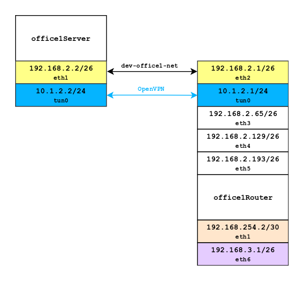
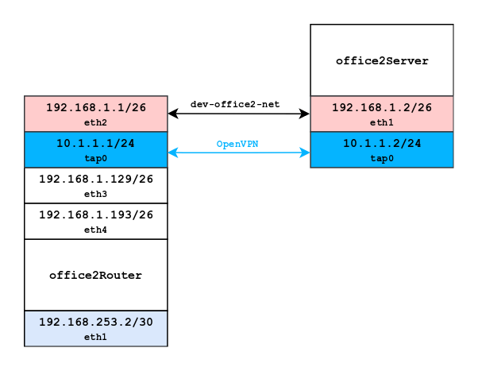
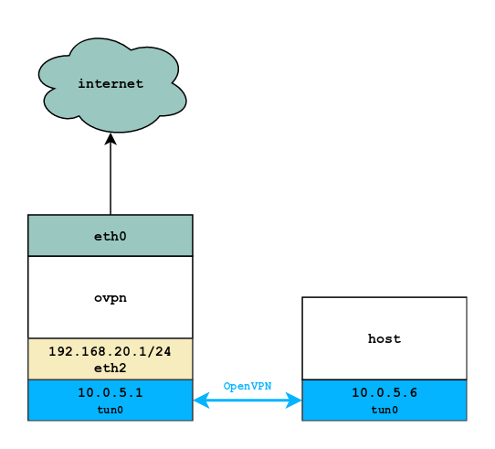

# Homework 11

##  Мосты, туннели и VPN
-------------
### Между двумя виртуалками поднять vpn в режимах tun и tap.
Для выполнения данного пункта использовал виртуальные машины из предыдущих ДЗ.

Vagrantfile для задания: [Vagrantfile](./tun_tap/Vagrantfile)

Для проверки ```tun``` необходимо выполнить:
```
vagrant up office1Router
vagrant up office1Server
```
<a href="https://raw.githubusercontent.com/reddare/otus-linux/master/hw11/tun_tap/hw11-tun.png" rel="Click!"></a>

Для проверки ```tap``` необходимо выполнить:
```
vagrant up office2Router
vagrant up office2Server
```
<a href="https://raw.githubusercontent.com/reddare/otus-linux/master/hw11/tun_tap/hw11-tap.png" rel="Click!"></a>
-------------
### Поднять RAS на базе OpenVPN с клиентскими сертификатами, подключиться с локальной машины на виртуалку.
Для выполнения данного пункта использовал отдельную виртуальную машину.

Процесс деплоя автоматизирован, запустить его необходимо выполнив данный [сценарий](./ovpn/vagrant_deploy.sh).

**Для успешного выполнения деплоя необходимы установленный ```vagrant``` и ```openvpn``` на хостовой машине!**

После запуска ```bash vagrant_deploy.sh``` будут воспроизведены следующие действия:
1. Загружен ```Vagrantfile``` из данного репозитория
2. Установлен плагин ```vagrant scp```
3. Произведен провиженинг виртуальной машины ```ovpn``` в роли ```OpenVPN``` сервера
4. Инициализация ```OpenVPN``` соединения с хостовой машины в виртуальную машину ```ovpn```

<a href="https://raw.githubusercontent.com/reddare/otus-linux/master/hw11/ovpn/hw11-tap.png" rel="Click!"></a>
