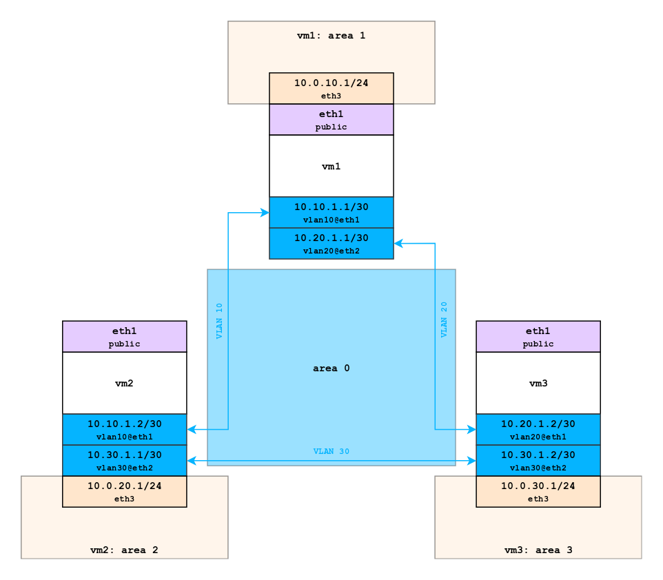
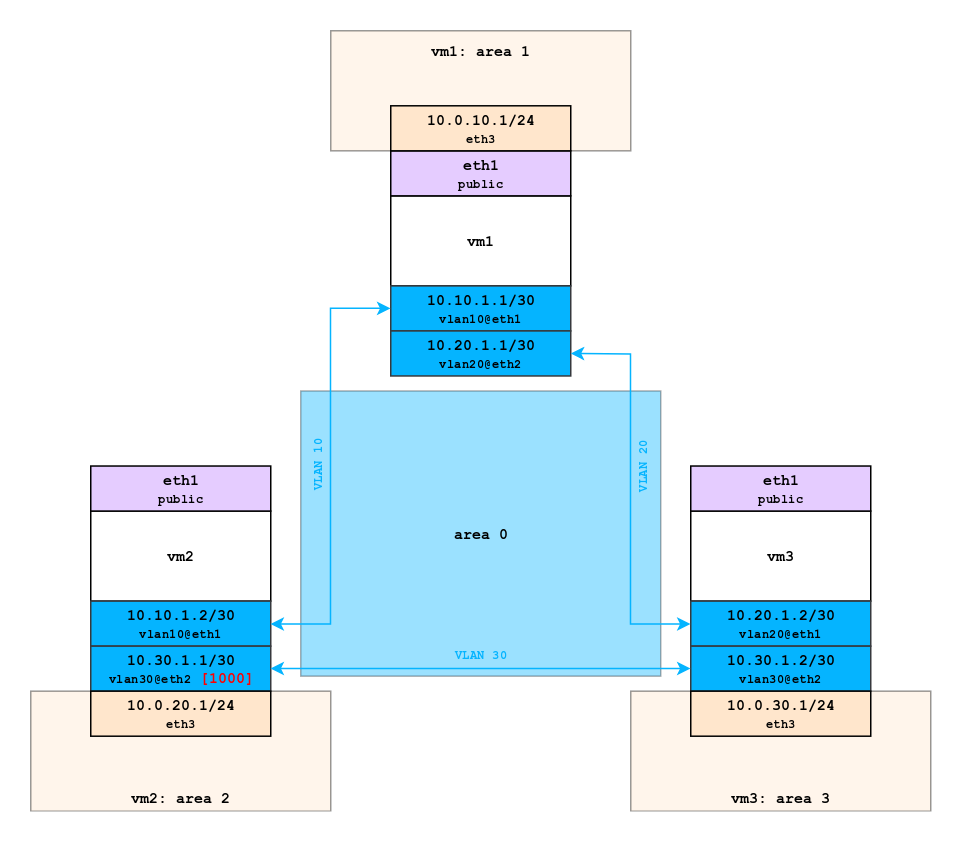
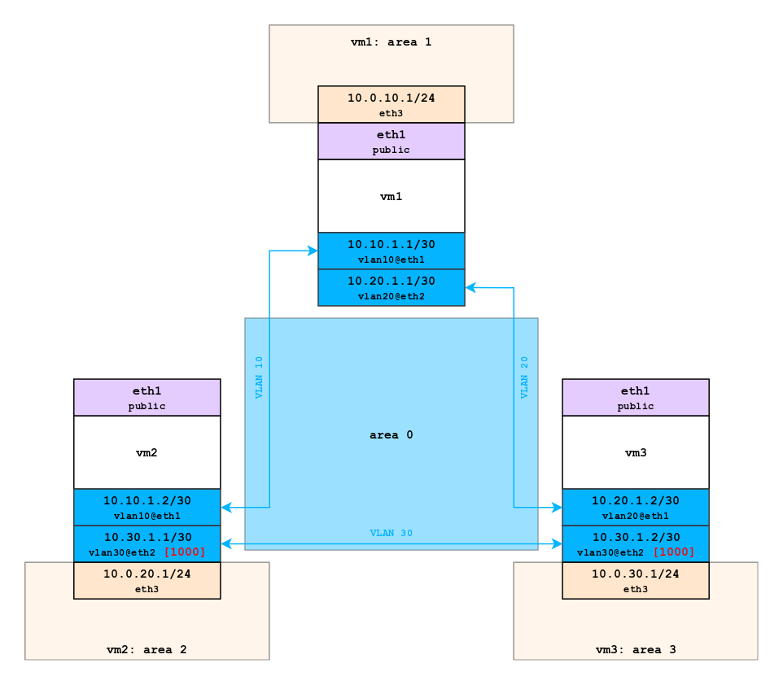

# Homework 12

##  Статическая и динамическая маршрутизация
-------------
### Поднять OSPF между машинами на базе Quagga.
Vagrantfile для задания: [Vagrantfile](./base_ospf/Vagrantfile)

<a href="https://raw.githubusercontent.com/reddare/otus-linux/master/hw12/base_ospf/hw12_base_ospf.png" rel="Click!"></a>

<details>
<summary><code>vm1</code></summary>
    
-------------

**```[vagrant@vm1 ~]$ ip a```**
    
```bash
1: lo: <LOOPBACK,UP,LOWER_UP> mtu 65536 qdisc noqueue state UNKNOWN group default qlen 1000
    link/loopback 00:00:00:00:00:00 brd 00:00:00:00:00:00
    inet 127.0.0.1/8 scope host lo
       valid_lft forever preferred_lft forever
    inet6 ::1/128 scope host 
       valid_lft forever preferred_lft forever
2: eth0: <BROADCAST,MULTICAST,UP,LOWER_UP> mtu 1500 qdisc pfifo_fast state UP group default qlen 
1000
    link/ether 52:54:00:c9:c7:04 brd ff:ff:ff:ff:ff:ff
    inet 10.0.2.15/24 brd 10.0.2.255 scope global noprefixroute dynamic eth0
       valid_lft 82938sec preferred_lft 82938sec
    inet6 fe80::5054:ff:fec9:c704/64 scope link 
       valid_lft forever preferred_lft forever
3: eth1: <BROADCAST,MULTICAST,UP,LOWER_UP> mtu 1500 qdisc pfifo_fast state UP group default qlen 
1000
    link/ether 08:00:27:fd:39:70 brd ff:ff:ff:ff:ff:ff
    inet6 fe80::bc86:6cf2:3731:aaad/64 scope link noprefixroute 
       valid_lft forever preferred_lft forever
4: eth2: <BROADCAST,MULTICAST,UP,LOWER_UP> mtu 1500 qdisc pfifo_fast state UP group default qlen 
1000
    link/ether 08:00:27:48:60:f0 brd ff:ff:ff:ff:ff:ff
    inet6 fe80::644a:a217:24d2:785a/64 scope link noprefixroute 
       valid_lft forever preferred_lft forever
5: eth3: <BROADCAST,MULTICAST,UP,LOWER_UP> mtu 1500 qdisc pfifo_fast state UP group default qlen 
1000
    link/ether 08:00:27:71:8e:73 brd ff:ff:ff:ff:ff:ff
    inet 10.0.10.1/24 brd 10.0.10.255 scope global noprefixroute eth3
       valid_lft forever preferred_lft forever
    inet6 fe80::a00:27ff:fe71:8e73/64 scope link 
       valid_lft forever preferred_lft forever
6: vlan10@eth1: <BROADCAST,MULTICAST,UP,LOWER_UP> mtu 1500 qdisc noqueue state UP group default q
len 1000
    link/ether 08:00:27:fd:39:70 brd ff:ff:ff:ff:ff:ff
    inet 10.10.1.1/30 brd 10.10.1.3 scope global noprefixroute vlan10
       valid_lft forever preferred_lft forever
    inet6 fe80::a00:27ff:fefd:3970/64 scope link 
       valid_lft forever preferred_lft forever
7: vlan20@eth2: <BROADCAST,MULTICAST,UP,LOWER_UP> mtu 1500 qdisc noqueue state UP group default q
len 1000
    link/ether 08:00:27:48:60:f0 brd ff:ff:ff:ff:ff:ff
    inet 10.20.1.1/30 brd 10.20.1.3 scope global noprefixroute vlan20
       valid_lft forever preferred_lft forever
    inet6 fe80::a00:27ff:fe48:60f0/64 scope link 
       valid_lft forever preferred_lft forever
 ```   
-------------
**```[vagrant@vm1 ~]$ tracepath 10.0.30.1```**
```bash
 1?: [LOCALHOST]                                         pmtu 1500
 1:  10.0.30.1                                             0.538ms reached
 1:  10.0.30.1                                             0.382ms reached
     Resume: pmtu 1500 hops 1 back 1 
```
-------------
**```[vagrant@vm1 ~]$ tracepath 10.0.20.1```**
```bash   
 1?: [LOCALHOST]                                         pmtu 1500
 1:  10.0.20.1                                             0.642ms reached
 1:  10.0.20.1                                             0.420ms reached
     Resume: pmtu 1500 hops 1 back 1 
```
-------------
**```/etc/quagga/daemons```**
```bash
zebra=yes
ospfd=yes
```
-------------
**```/etc/quagga/zebra.conf```**
```bash
hostname vm1
log file /var/log/quagga/zebra.log 
interface eth3
ip address 10.0.10.1/24
interface vlan10
ip address 10.10.1.1/30
interface vlan20
ip address 10.20.1.1/30
```
-------------
**```/etc/quagga/ospfd.conf```**
```bash
hostname vm1
router ospf
    ospf router-id 10.10.1.1
    network 10.10.1.0/30 area 0
    network 10.20.1.0/30 area 0
    network 10.0.10.0/24 area 1
    redistribute connected
log file /var/log/quagga/ospfd.log
```
</details>

<details>
<summary><code>vm2</code></summary>
    
-------------

**```[vagrant@vm2 ~]$ ip a```**
    
```bash
1: lo: <LOOPBACK,UP,LOWER_UP> mtu 65536 qdisc noqueue state UNKNOWN group default qlen 1000
    link/loopback 00:00:00:00:00:00 brd 00:00:00:00:00:00
    inet 127.0.0.1/8 scope host lo
       valid_lft forever preferred_lft forever
    inet6 ::1/128 scope host 
       valid_lft forever preferred_lft forever
2: eth0: <BROADCAST,MULTICAST,UP,LOWER_UP> mtu 1500 qdisc pfifo_fast state UP group default qlen 
1000
    link/ether 52:54:00:c9:c7:04 brd ff:ff:ff:ff:ff:ff
    inet 10.0.2.15/24 brd 10.0.2.255 scope global noprefixroute dynamic eth0
       valid_lft 83425sec preferred_lft 83425sec
    inet6 fe80::5054:ff:fec9:c704/64 scope link 
       valid_lft forever preferred_lft forever
3: eth1: <BROADCAST,MULTICAST,UP,LOWER_UP> mtu 1500 qdisc pfifo_fast state UP group default qlen 
1000
    link/ether 08:00:27:11:74:36 brd ff:ff:ff:ff:ff:ff
    inet6 fe80::4318:6421:fe99:c0ab/64 scope link noprefixroute 
       valid_lft forever preferred_lft forever
4: eth2: <BROADCAST,MULTICAST,UP,LOWER_UP> mtu 1500 qdisc pfifo_fast state UP group default qlen 
1000
    link/ether 08:00:27:af:3b:4b brd ff:ff:ff:ff:ff:ff
    inet6 fe80::a961:a61e:1ea1:86ea/64 scope link noprefixroute 
       valid_lft forever preferred_lft forever
5: eth3: <BROADCAST,MULTICAST,UP,LOWER_UP> mtu 1500 qdisc pfifo_fast state UP group default qlen 
1000
    link/ether 08:00:27:a2:2f:df brd ff:ff:ff:ff:ff:ff
    inet 10.0.20.1/24 brd 10.0.20.255 scope global noprefixroute eth3
       valid_lft forever preferred_lft forever
    inet6 fe80::a00:27ff:fea2:2fdf/64 scope link 
       valid_lft forever preferred_lft forever
6: vlan10@eth1: <BROADCAST,MULTICAST,UP,LOWER_UP> mtu 1500 qdisc noqueue state UP group default q
len 1000
    link/ether 08:00:27:11:74:36 brd ff:ff:ff:ff:ff:ff
    inet 10.10.1.2/30 brd 10.10.1.3 scope global noprefixroute vlan10
       valid_lft forever preferred_lft forever
    inet6 fe80::a00:27ff:fe11:7436/64 scope link 
       valid_lft forever preferred_lft forever
7: vlan30@eth2: <BROADCAST,MULTICAST,UP,LOWER_UP> mtu 1500 qdisc noqueue state UP group default q
len 1000
    link/ether 08:00:27:af:3b:4b brd ff:ff:ff:ff:ff:ff
    inet 10.30.1.1/30 brd 10.30.1.3 scope global noprefixroute vlan30
       valid_lft forever preferred_lft forever
    inet6 fe80::a00:27ff:feaf:3b4b/64 scope link 
       valid_lft forever preferred_lft forever
 ```   
-------------
**```[vagrant@vm2 ~]$ tracepath 10.0.10.1```**
```bash
 1?: [LOCALHOST]                                         pmtu 1500
 1:  10.0.10.1                                             0.656ms reached
 1:  10.0.10.1                                             0.411ms reached
     Resume: pmtu 1500 hops 1 back 1 
```
-------------
**```[vagrant@vm2 ~]$ tracepath 10.0.30.1```**
```bash   
 1?: [LOCALHOST]                                         pmtu 1500
 1:  10.0.30.1                                             0.316ms reached
 1:  10.0.30.1                                             0.312ms reached
     Resume: pmtu 1500 hops 1 back 1 
```
-------------
**```/etc/quagga/daemons```**
```bash
zebra=yes
ospfd=yes
```
-------------
**```/etc/quagga/zebra.conf```**
```bash
hostname vm2
log file /var/log/quagga/zebra.log 
interface eth3
ip address 10.0.20.1/24
interface vlan10
ip address 10.10.1.2/30
interface vlan30
ip address 10.30.1.1/30
```
-------------
**```/etc/quagga/ospfd.conf```**
```bash
hostname vm2
router ospf
    ospf router-id 10.10.1.2
    network 10.10.1.0/30 area 0
    network 10.30.1.0/30 area 0
    network 10.0.20.0/24 area 1
    redistribute connected
log file /var/log/quagga/ospfd.log
```
</details>

<details>
<summary><code>vm3</code></summary>
    
-------------

**```[vagrant@vm3 ~]$ ip a```**
    
```bash
1: lo: <LOOPBACK,UP,LOWER_UP> mtu 65536 qdisc noqueue state UNKNOWN group default qlen 1000
    link/loopback 00:00:00:00:00:00 brd 00:00:00:00:00:00
    inet 127.0.0.1/8 scope host lo
       valid_lft forever preferred_lft forever
    inet6 ::1/128 scope host 
       valid_lft forever preferred_lft forever
2: eth0: <BROADCAST,MULTICAST,UP,LOWER_UP> mtu 1500 qdisc pfifo_fast state UP group default qlen 
1000
    link/ether 52:54:00:c9:c7:04 brd ff:ff:ff:ff:ff:ff
    inet 10.0.2.15/24 brd 10.0.2.255 scope global noprefixroute dynamic eth0
       valid_lft 84504sec preferred_lft 84504sec
    inet6 fe80::5054:ff:fec9:c704/64 scope link 
       valid_lft forever preferred_lft forever
3: eth1: <BROADCAST,MULTICAST,UP,LOWER_UP> mtu 1500 qdisc pfifo_fast state UP group default qlen 
1000
    link/ether 08:00:27:34:11:d0 brd ff:ff:ff:ff:ff:ff
4: eth2: <BROADCAST,MULTICAST,UP,LOWER_UP> mtu 1500 qdisc pfifo_fast state UP group default qlen 
1000
    link/ether 08:00:27:b1:64:92 brd ff:ff:ff:ff:ff:ff
5: eth3: <BROADCAST,MULTICAST,UP,LOWER_UP> mtu 1500 qdisc pfifo_fast state UP group default qlen 
1000
    link/ether 08:00:27:02:47:c6 brd ff:ff:ff:ff:ff:ff
    inet 10.0.30.1/24 brd 10.0.30.255 scope global noprefixroute eth3
       valid_lft forever preferred_lft forever
    inet6 fe80::a00:27ff:fe02:47c6/64 scope link 
       valid_lft forever preferred_lft forever
6: vlan20@eth1: <BROADCAST,MULTICAST,UP,LOWER_UP> mtu 1500 qdisc noqueue state UP group default q
len 1000
    link/ether 08:00:27:34:11:d0 brd ff:ff:ff:ff:ff:ff
    inet 10.20.1.2/30 brd 10.20.1.3 scope global noprefixroute vlan20
       valid_lft forever preferred_lft forever
    inet6 fe80::a00:27ff:fe34:11d0/64 scope link 
       valid_lft forever preferred_lft forever
7: vlan30@eth2: <BROADCAST,MULTICAST,UP,LOWER_UP> mtu 1500 qdisc noqueue state UP group default q
len 1000
    link/ether 08:00:27:b1:64:92 brd ff:ff:ff:ff:ff:ff
    inet 10.30.1.2/30 brd 10.30.1.3 scope global noprefixroute vlan30
       valid_lft forever preferred_lft forever
    inet6 fe80::a00:27ff:feb1:6492/64 scope link 
       valid_lft forever preferred_lft forever
 ```   
-------------
**```[vagrant@vm3 ~]$ tracepath 10.0.10.1```**
```bash
 1?: [LOCALHOST]                                         pmtu 1500
 1:  10.0.10.1                                             0.656ms reached
 1:  10.0.10.1                                             0.411ms reached
     Resume: pmtu 1500 hops 1 back 1 
```
-------------
**```[vagrant@vm3 ~]$ tracepath 10.0.20.1```**
```bash   
 1?: [LOCALHOST]                                         pmtu 1500
 1:  10.0.20.1                                             0.316ms reached
 1:  10.0.20.1                                             0.312ms reached
     Resume: pmtu 1500 hops 1 back 1 
```
-------------
**```/etc/quagga/daemons```**
```bash
zebra=yes
ospfd=yes
```
-------------
**```/etc/quagga/zebra.conf```**
```bash
hostname vm3
log file /var/log/quagga/zebra.log 
interface eth3
ip address 10.0.30.1/24
interface vlan20
ip address 10.20.1.2/30
interface vlan30
ip address 10.30.1.2/30
```
-------------
**```/etc/quagga/ospfd.conf```**
```bash
hostname vm3
router ospf
    ospf router-id 10.20.1.2
    network 10.20.1.0/30 area 0
    network 10.30.1.0/30 area 0
    network 10.0.30.0/24 area 1
    redistribute connected
log file /var/log/quagga/ospfd.log
```
</details>

-------------
### Изобразить ассиметричный роутинг.
Vagrantfile для задания: [Vagrantfile](./asymm_ospf/Vagrantfile)

<a href="https://raw.githubusercontent.com/reddare/otus-linux/master/hw12/asymm_ospf/hw12_asymm_ospf.png" rel="Click!"></a>

<details>
<summary><code>vm1</code></summary>
    
-------------

**```[vagrant@vm1 ~]$ ip a```**
    
```bash
1: lo: <LOOPBACK,UP,LOWER_UP> mtu 65536 qdisc noqueue state UNKNOWN group default qlen 1000
    link/loopback 00:00:00:00:00:00 brd 00:00:00:00:00:00
    inet 127.0.0.1/8 scope host lo
       valid_lft forever preferred_lft forever
    inet6 ::1/128 scope host 
       valid_lft forever preferred_lft forever
2: eth0: <BROADCAST,MULTICAST,UP,LOWER_UP> mtu 1500 qdisc pfifo_fast state UP group default qlen 
1000
    link/ether 52:54:00:c9:c7:04 brd ff:ff:ff:ff:ff:ff
    inet 10.0.2.15/24 brd 10.0.2.255 scope global noprefixroute dynamic eth0
       valid_lft 82938sec preferred_lft 82938sec
    inet6 fe80::5054:ff:fec9:c704/64 scope link 
       valid_lft forever preferred_lft forever
3: eth1: <BROADCAST,MULTICAST,UP,LOWER_UP> mtu 1500 qdisc pfifo_fast state UP group default qlen 
1000
    link/ether 08:00:27:fd:39:70 brd ff:ff:ff:ff:ff:ff
    inet6 fe80::bc86:6cf2:3731:aaad/64 scope link noprefixroute 
       valid_lft forever preferred_lft forever
4: eth2: <BROADCAST,MULTICAST,UP,LOWER_UP> mtu 1500 qdisc pfifo_fast state UP group default qlen 
1000
    link/ether 08:00:27:48:60:f0 brd ff:ff:ff:ff:ff:ff
    inet6 fe80::644a:a217:24d2:785a/64 scope link noprefixroute 
       valid_lft forever preferred_lft forever
5: eth3: <BROADCAST,MULTICAST,UP,LOWER_UP> mtu 1500 qdisc pfifo_fast state UP group default qlen 
1000
    link/ether 08:00:27:71:8e:73 brd ff:ff:ff:ff:ff:ff
    inet 10.0.10.1/24 brd 10.0.10.255 scope global noprefixroute eth3
       valid_lft forever preferred_lft forever
    inet6 fe80::a00:27ff:fe71:8e73/64 scope link 
       valid_lft forever preferred_lft forever
6: vlan10@eth1: <BROADCAST,MULTICAST,UP,LOWER_UP> mtu 1500 qdisc noqueue state UP group default q
len 1000
    link/ether 08:00:27:fd:39:70 brd ff:ff:ff:ff:ff:ff
    inet 10.10.1.1/30 brd 10.10.1.3 scope global noprefixroute vlan10
       valid_lft forever preferred_lft forever
    inet6 fe80::a00:27ff:fefd:3970/64 scope link 
       valid_lft forever preferred_lft forever
7: vlan20@eth2: <BROADCAST,MULTICAST,UP,LOWER_UP> mtu 1500 qdisc noqueue state UP group default q
len 1000
    link/ether 08:00:27:48:60:f0 brd ff:ff:ff:ff:ff:ff
    inet 10.20.1.1/30 brd 10.20.1.3 scope global noprefixroute vlan20
       valid_lft forever preferred_lft forever
    inet6 fe80::a00:27ff:fe48:60f0/64 scope link 
       valid_lft forever preferred_lft forever
 ```   
-------------
**```[vagrant@vm1 ~]$ tracepath 10.0.30.1```**
```bash
 1?: [LOCALHOST]                                         pmtu 1500
 1:  10.0.30.1                                             0.538ms reached
 1:  10.0.30.1                                             0.382ms reached
     Resume: pmtu 1500 hops 1 back 1 
```
-------------
**```[vagrant@vm1 ~]$ tracepath 10.0.20.1```**
```bash   
 1?: [LOCALHOST]                                         pmtu 1500
 1:  10.0.20.1                                             0.642ms reached
 1:  10.0.20.1                                             0.420ms reached
     Resume: pmtu 1500 hops 1 back 1 
```
-------------
**```/etc/quagga/daemons```**
```bash
zebra=yes
ospfd=yes
```
-------------
**```/etc/quagga/zebra.conf```**
```bash
hostname vm1
log file /var/log/quagga/zebra.log 
interface eth3
ip address 10.0.10.1/24
interface vlan10
ip address 10.10.1.1/30
interface vlan20
ip address 10.20.1.1/30
```
-------------
**```/etc/quagga/ospfd.conf```**
```bash
hostname vm1
router ospf
    ospf router-id 10.10.1.1
    network 10.10.1.0/30 area 0
    network 10.20.1.0/30 area 0
    network 10.0.10.0/24 area 1
    redistribute connected
log file /var/log/quagga/ospfd.log
```
</details>

<details>
<summary><code>vm2</code></summary>
    
-------------

**```[vagrant@vm2 ~]$ ip a```**
    
```bash
1: lo: <LOOPBACK,UP,LOWER_UP> mtu 65536 qdisc noqueue state UNKNOWN group default qlen 1000
    link/loopback 00:00:00:00:00:00 brd 00:00:00:00:00:00
    inet 127.0.0.1/8 scope host lo
       valid_lft forever preferred_lft forever
    inet6 ::1/128 scope host 
       valid_lft forever preferred_lft forever
2: eth0: <BROADCAST,MULTICAST,UP,LOWER_UP> mtu 1500 qdisc pfifo_fast state UP group default qlen 
1000
    link/ether 52:54:00:c9:c7:04 brd ff:ff:ff:ff:ff:ff
    inet 10.0.2.15/24 brd 10.0.2.255 scope global noprefixroute dynamic eth0
       valid_lft 83425sec preferred_lft 83425sec
    inet6 fe80::5054:ff:fec9:c704/64 scope link 
       valid_lft forever preferred_lft forever
3: eth1: <BROADCAST,MULTICAST,UP,LOWER_UP> mtu 1500 qdisc pfifo_fast state UP group default qlen 
1000
    link/ether 08:00:27:11:74:36 brd ff:ff:ff:ff:ff:ff
    inet6 fe80::4318:6421:fe99:c0ab/64 scope link noprefixroute 
       valid_lft forever preferred_lft forever
4: eth2: <BROADCAST,MULTICAST,UP,LOWER_UP> mtu 1500 qdisc pfifo_fast state UP group default qlen 
1000
    link/ether 08:00:27:af:3b:4b brd ff:ff:ff:ff:ff:ff
    inet6 fe80::a961:a61e:1ea1:86ea/64 scope link noprefixroute 
       valid_lft forever preferred_lft forever
5: eth3: <BROADCAST,MULTICAST,UP,LOWER_UP> mtu 1500 qdisc pfifo_fast state UP group default qlen 
1000
    link/ether 08:00:27:a2:2f:df brd ff:ff:ff:ff:ff:ff
    inet 10.0.20.1/24 brd 10.0.20.255 scope global noprefixroute eth3
       valid_lft forever preferred_lft forever
    inet6 fe80::a00:27ff:fea2:2fdf/64 scope link 
       valid_lft forever preferred_lft forever
6: vlan10@eth1: <BROADCAST,MULTICAST,UP,LOWER_UP> mtu 1500 qdisc noqueue state UP group default q
len 1000
    link/ether 08:00:27:11:74:36 brd ff:ff:ff:ff:ff:ff
    inet 10.10.1.2/30 brd 10.10.1.3 scope global noprefixroute vlan10
       valid_lft forever preferred_lft forever
    inet6 fe80::a00:27ff:fe11:7436/64 scope link 
       valid_lft forever preferred_lft forever
7: vlan30@eth2: <BROADCAST,MULTICAST,UP,LOWER_UP> mtu 1500 qdisc noqueue state UP group default q
len 1000
    link/ether 08:00:27:af:3b:4b brd ff:ff:ff:ff:ff:ff
    inet 10.30.1.1/30 brd 10.30.1.3 scope global noprefixroute vlan30
       valid_lft forever preferred_lft forever
    inet6 fe80::a00:27ff:feaf:3b4b/64 scope link 
       valid_lft forever preferred_lft forever
 ```   
-------------
**```[vagrant@vm2 ~]$ tracepath 10.0.10.1```**
```bash
 1?: [LOCALHOST]                                         pmtu 1500
 1:  10.0.10.1                                             0.656ms reached
 1:  10.0.10.1                                             0.411ms reached
     Resume: pmtu 1500 hops 1 back 1 
```
-------------
**```[vagrant@vm2 ~]$ tracepath 10.0.30.1```**
```bash   
 1?: [LOCALHOST]                                         pmtu 1500
 1:  10.10.1.1                                             0.455ms 
 1:  10.10.1.1                                             0.395ms 
 2:  10.0.30.1                                             0.764ms reached
     Resume: pmtu 1500 hops 2 back 2 
```
-------------
**```/etc/quagga/daemons```**
```bash
zebra=yes
ospfd=yes
```
-------------
**```/etc/quagga/zebra.conf```**
```bash
hostname vm2
log file /var/log/quagga/zebra.log 
interface eth3
ip address 10.0.20.1/24
interface vlan10
ip address 10.10.1.2/30
interface vlan30
ip address 10.30.1.1/30
```
-------------
**```/etc/quagga/ospfd.conf```**
```bash
hostname vm2
router ospf
    ospf router-id 10.10.1.2
    network 10.10.1.0/30 area 0
    network 10.30.1.0/30 area 0
    network 10.0.20.0/24 area 1
    redistribute connected
interface vlan30
ip ospf cost 1000
log file /var/log/quagga/ospfd.log
```
</details>

<details>
<summary><code>vm3</code></summary>
    
-------------

**```[vagrant@vm3 ~]$ ip a```**
    
```bash
1: lo: <LOOPBACK,UP,LOWER_UP> mtu 65536 qdisc noqueue state UNKNOWN group default qlen 1000
    link/loopback 00:00:00:00:00:00 brd 00:00:00:00:00:00
    inet 127.0.0.1/8 scope host lo
       valid_lft forever preferred_lft forever
    inet6 ::1/128 scope host 
       valid_lft forever preferred_lft forever
2: eth0: <BROADCAST,MULTICAST,UP,LOWER_UP> mtu 1500 qdisc pfifo_fast state UP group default qlen 
1000
    link/ether 52:54:00:c9:c7:04 brd ff:ff:ff:ff:ff:ff
    inet 10.0.2.15/24 brd 10.0.2.255 scope global noprefixroute dynamic eth0
       valid_lft 84504sec preferred_lft 84504sec
    inet6 fe80::5054:ff:fec9:c704/64 scope link 
       valid_lft forever preferred_lft forever
3: eth1: <BROADCAST,MULTICAST,UP,LOWER_UP> mtu 1500 qdisc pfifo_fast state UP group default qlen 
1000
    link/ether 08:00:27:34:11:d0 brd ff:ff:ff:ff:ff:ff
4: eth2: <BROADCAST,MULTICAST,UP,LOWER_UP> mtu 1500 qdisc pfifo_fast state UP group default qlen 
1000
    link/ether 08:00:27:b1:64:92 brd ff:ff:ff:ff:ff:ff
5: eth3: <BROADCAST,MULTICAST,UP,LOWER_UP> mtu 1500 qdisc pfifo_fast state UP group default qlen 
1000
    link/ether 08:00:27:02:47:c6 brd ff:ff:ff:ff:ff:ff
    inet 10.0.30.1/24 brd 10.0.30.255 scope global noprefixroute eth3
       valid_lft forever preferred_lft forever
    inet6 fe80::a00:27ff:fe02:47c6/64 scope link 
       valid_lft forever preferred_lft forever
6: vlan20@eth1: <BROADCAST,MULTICAST,UP,LOWER_UP> mtu 1500 qdisc noqueue state UP group default q
len 1000
    link/ether 08:00:27:34:11:d0 brd ff:ff:ff:ff:ff:ff
    inet 10.20.1.2/30 brd 10.20.1.3 scope global noprefixroute vlan20
       valid_lft forever preferred_lft forever
    inet6 fe80::a00:27ff:fe34:11d0/64 scope link 
       valid_lft forever preferred_lft forever
7: vlan30@eth2: <BROADCAST,MULTICAST,UP,LOWER_UP> mtu 1500 qdisc noqueue state UP group default q
len 1000
    link/ether 08:00:27:b1:64:92 brd ff:ff:ff:ff:ff:ff
    inet 10.30.1.2/30 brd 10.30.1.3 scope global noprefixroute vlan30
       valid_lft forever preferred_lft forever
    inet6 fe80::a00:27ff:feb1:6492/64 scope link 
       valid_lft forever preferred_lft forever
 ```   
-------------
**```[vagrant@vm3 ~]$ tracepath 10.0.10.1```**
```bash
 1?: [LOCALHOST]                                         pmtu 1500
 1:  10.0.10.1                                             0.656ms reached
 1:  10.0.10.1                                             0.411ms reached
     Resume: pmtu 1500 hops 1 back 1 
```
-------------
**```[vagrant@vm3 ~]$ tracepath 10.0.20.1```**
```bash   
 1?: [LOCALHOST]                                         pmtu 1500
 1:  10.0.20.1                                             0.316ms reached
 1:  10.0.20.1                                             0.312ms reached
     Resume: pmtu 1500 hops 1 back 1 
```
-------------
**```/etc/quagga/daemons```**
```bash
zebra=yes
ospfd=yes
```
-------------
**```/etc/quagga/zebra.conf```**
```bash
hostname vm3
log file /var/log/quagga/zebra.log 
interface eth3
ip address 10.0.30.1/24
interface vlan20
ip address 10.20.1.2/30
interface vlan30
ip address 10.30.1.2/30
```
-------------
**```/etc/quagga/ospfd.conf```**
```bash
hostname vm3
router ospf
    ospf router-id 10.20.1.2
    network 10.20.1.0/30 area 0
    network 10.30.1.0/30 area 0
    network 10.0.30.0/24 area 1
    redistribute connected
log file /var/log/quagga/ospfd.log
```
</details>

-------------
### Сделать один из линков "дорогим", но что бы при этом роутинг был симметричным.
Vagrantfile для задания: [Vagrantfile](./same_cost_ospf/Vagrantfile)

<a href="https://raw.githubusercontent.com/reddare/otus-linux/master/hw12/same_cost_ospf/hw12_same_cost_ospf.png" rel="Click!"></a>

<details>
<summary><code>vm1</code></summary>
    
-------------

**```[vagrant@vm1 ~]$ ip a```**
    
```bash
1: lo: <LOOPBACK,UP,LOWER_UP> mtu 65536 qdisc noqueue state UNKNOWN group default qlen 1000
    link/loopback 00:00:00:00:00:00 brd 00:00:00:00:00:00
    inet 127.0.0.1/8 scope host lo
       valid_lft forever preferred_lft forever
    inet6 ::1/128 scope host 
       valid_lft forever preferred_lft forever
2: eth0: <BROADCAST,MULTICAST,UP,LOWER_UP> mtu 1500 qdisc pfifo_fast state UP group default qlen 
1000
    link/ether 52:54:00:c9:c7:04 brd ff:ff:ff:ff:ff:ff
    inet 10.0.2.15/24 brd 10.0.2.255 scope global noprefixroute dynamic eth0
       valid_lft 82938sec preferred_lft 82938sec
    inet6 fe80::5054:ff:fec9:c704/64 scope link 
       valid_lft forever preferred_lft forever
3: eth1: <BROADCAST,MULTICAST,UP,LOWER_UP> mtu 1500 qdisc pfifo_fast state UP group default qlen 
1000
    link/ether 08:00:27:fd:39:70 brd ff:ff:ff:ff:ff:ff
    inet6 fe80::bc86:6cf2:3731:aaad/64 scope link noprefixroute 
       valid_lft forever preferred_lft forever
4: eth2: <BROADCAST,MULTICAST,UP,LOWER_UP> mtu 1500 qdisc pfifo_fast state UP group default qlen 
1000
    link/ether 08:00:27:48:60:f0 brd ff:ff:ff:ff:ff:ff
    inet6 fe80::644a:a217:24d2:785a/64 scope link noprefixroute 
       valid_lft forever preferred_lft forever
5: eth3: <BROADCAST,MULTICAST,UP,LOWER_UP> mtu 1500 qdisc pfifo_fast state UP group default qlen 
1000
    link/ether 08:00:27:71:8e:73 brd ff:ff:ff:ff:ff:ff
    inet 10.0.10.1/24 brd 10.0.10.255 scope global noprefixroute eth3
       valid_lft forever preferred_lft forever
    inet6 fe80::a00:27ff:fe71:8e73/64 scope link 
       valid_lft forever preferred_lft forever
6: vlan10@eth1: <BROADCAST,MULTICAST,UP,LOWER_UP> mtu 1500 qdisc noqueue state UP group default q
len 1000
    link/ether 08:00:27:fd:39:70 brd ff:ff:ff:ff:ff:ff
    inet 10.10.1.1/30 brd 10.10.1.3 scope global noprefixroute vlan10
       valid_lft forever preferred_lft forever
    inet6 fe80::a00:27ff:fefd:3970/64 scope link 
       valid_lft forever preferred_lft forever
7: vlan20@eth2: <BROADCAST,MULTICAST,UP,LOWER_UP> mtu 1500 qdisc noqueue state UP group default q
len 1000
    link/ether 08:00:27:48:60:f0 brd ff:ff:ff:ff:ff:ff
    inet 10.20.1.1/30 brd 10.20.1.3 scope global noprefixroute vlan20
       valid_lft forever preferred_lft forever
    inet6 fe80::a00:27ff:fe48:60f0/64 scope link 
       valid_lft forever preferred_lft forever
 ```   
-------------
**```[vagrant@vm1 ~]$ tracepath 10.0.30.1```**
```bash
 1?: [LOCALHOST]                                         pmtu 1500
 1:  10.0.30.1                                             0.538ms reached
 1:  10.0.30.1                                             0.382ms reached
     Resume: pmtu 1500 hops 1 back 1 
```
-------------
**```[vagrant@vm1 ~]$ tracepath 10.0.20.1```**
```bash   
 1?: [LOCALHOST]                                         pmtu 1500
 1:  10.0.20.1                                             0.642ms reached
 1:  10.0.20.1                                             0.420ms reached
     Resume: pmtu 1500 hops 1 back 1 
```
-------------
**```/etc/quagga/daemons```**
```bash
zebra=yes
ospfd=yes
```
-------------
**```/etc/quagga/zebra.conf```**
```bash
hostname vm1
log file /var/log/quagga/zebra.log 
interface eth3
ip address 10.0.10.1/24
interface vlan10
ip address 10.10.1.1/30
interface vlan20
ip address 10.20.1.1/30
```
-------------
**```/etc/quagga/ospfd.conf```**
```bash
hostname vm1
router ospf
    ospf router-id 10.10.1.1
    network 10.10.1.0/30 area 0
    network 10.20.1.0/30 area 0
    network 10.0.10.0/24 area 1
    redistribute connected
log file /var/log/quagga/ospfd.log
```
</details>

<details>
<summary><code>vm2</code></summary>
    
-------------

**```[vagrant@vm2 ~]$ ip a```**
    
```bash
1: lo: <LOOPBACK,UP,LOWER_UP> mtu 65536 qdisc noqueue state UNKNOWN group default qlen 1000
    link/loopback 00:00:00:00:00:00 brd 00:00:00:00:00:00
    inet 127.0.0.1/8 scope host lo
       valid_lft forever preferred_lft forever
    inet6 ::1/128 scope host 
       valid_lft forever preferred_lft forever
2: eth0: <BROADCAST,MULTICAST,UP,LOWER_UP> mtu 1500 qdisc pfifo_fast state UP group default qlen 
1000
    link/ether 52:54:00:c9:c7:04 brd ff:ff:ff:ff:ff:ff
    inet 10.0.2.15/24 brd 10.0.2.255 scope global noprefixroute dynamic eth0
       valid_lft 83425sec preferred_lft 83425sec
    inet6 fe80::5054:ff:fec9:c704/64 scope link 
       valid_lft forever preferred_lft forever
3: eth1: <BROADCAST,MULTICAST,UP,LOWER_UP> mtu 1500 qdisc pfifo_fast state UP group default qlen 
1000
    link/ether 08:00:27:11:74:36 brd ff:ff:ff:ff:ff:ff
    inet6 fe80::4318:6421:fe99:c0ab/64 scope link noprefixroute 
       valid_lft forever preferred_lft forever
4: eth2: <BROADCAST,MULTICAST,UP,LOWER_UP> mtu 1500 qdisc pfifo_fast state UP group default qlen 
1000
    link/ether 08:00:27:af:3b:4b brd ff:ff:ff:ff:ff:ff
    inet6 fe80::a961:a61e:1ea1:86ea/64 scope link noprefixroute 
       valid_lft forever preferred_lft forever
5: eth3: <BROADCAST,MULTICAST,UP,LOWER_UP> mtu 1500 qdisc pfifo_fast state UP group default qlen 
1000
    link/ether 08:00:27:a2:2f:df brd ff:ff:ff:ff:ff:ff
    inet 10.0.20.1/24 brd 10.0.20.255 scope global noprefixroute eth3
       valid_lft forever preferred_lft forever
    inet6 fe80::a00:27ff:fea2:2fdf/64 scope link 
       valid_lft forever preferred_lft forever
6: vlan10@eth1: <BROADCAST,MULTICAST,UP,LOWER_UP> mtu 1500 qdisc noqueue state UP group default q
len 1000
    link/ether 08:00:27:11:74:36 brd ff:ff:ff:ff:ff:ff
    inet 10.10.1.2/30 brd 10.10.1.3 scope global noprefixroute vlan10
       valid_lft forever preferred_lft forever
    inet6 fe80::a00:27ff:fe11:7436/64 scope link 
       valid_lft forever preferred_lft forever
7: vlan30@eth2: <BROADCAST,MULTICAST,UP,LOWER_UP> mtu 1500 qdisc noqueue state UP group default q
len 1000
    link/ether 08:00:27:af:3b:4b brd ff:ff:ff:ff:ff:ff
    inet 10.30.1.1/30 brd 10.30.1.3 scope global noprefixroute vlan30
       valid_lft forever preferred_lft forever
    inet6 fe80::a00:27ff:feaf:3b4b/64 scope link 
       valid_lft forever preferred_lft forever
 ```   
-------------
**```[vagrant@vm2 ~]$ tracepath 10.0.10.1```**
```bash
 1?: [LOCALHOST]                                         pmtu 1500
 1:  10.0.10.1                                             0.656ms reached
 1:  10.0.10.1                                             0.411ms reached
     Resume: pmtu 1500 hops 1 back 1 
```
-------------
**```[vagrant@vm2 ~]$ tracepath 10.0.30.1```**
```bash   
 1?: [LOCALHOST]                                         pmtu 1500
 1:  10.10.1.1                                             0.455ms 
 1:  10.10.1.1                                             0.395ms 
 2:  10.0.30.1                                             0.764ms reached
     Resume: pmtu 1500 hops 2 back 2 
```
-------------
**```/etc/quagga/daemons```**
```bash
zebra=yes
ospfd=yes
```
-------------
**```/etc/quagga/zebra.conf```**
```bash
hostname vm2
log file /var/log/quagga/zebra.log 
interface eth3
ip address 10.0.20.1/24
interface vlan10
ip address 10.10.1.2/30
interface vlan30
ip address 10.30.1.1/30
```
-------------
**```/etc/quagga/ospfd.conf```**
```bash
hostname vm2
router ospf
    ospf router-id 10.10.1.2
    network 10.10.1.0/30 area 0
    network 10.30.1.0/30 area 0
    network 10.0.20.0/24 area 1
    redistribute connected
interface vlan30
ip ospf cost 1000
log file /var/log/quagga/ospfd.log
```
</details>

<details>
<summary><code>vm3</code></summary>
    
-------------

**```[vagrant@vm3 ~]$ ip a```**
    
```bash
1: lo: <LOOPBACK,UP,LOWER_UP> mtu 65536 qdisc noqueue state UNKNOWN group default qlen 1000
    link/loopback 00:00:00:00:00:00 brd 00:00:00:00:00:00
    inet 127.0.0.1/8 scope host lo
       valid_lft forever preferred_lft forever
    inet6 ::1/128 scope host 
       valid_lft forever preferred_lft forever
2: eth0: <BROADCAST,MULTICAST,UP,LOWER_UP> mtu 1500 qdisc pfifo_fast state UP group default qlen 
1000
    link/ether 52:54:00:c9:c7:04 brd ff:ff:ff:ff:ff:ff
    inet 10.0.2.15/24 brd 10.0.2.255 scope global noprefixroute dynamic eth0
       valid_lft 84504sec preferred_lft 84504sec
    inet6 fe80::5054:ff:fec9:c704/64 scope link 
       valid_lft forever preferred_lft forever
3: eth1: <BROADCAST,MULTICAST,UP,LOWER_UP> mtu 1500 qdisc pfifo_fast state UP group default qlen 
1000
    link/ether 08:00:27:34:11:d0 brd ff:ff:ff:ff:ff:ff
4: eth2: <BROADCAST,MULTICAST,UP,LOWER_UP> mtu 1500 qdisc pfifo_fast state UP group default qlen 
1000
    link/ether 08:00:27:b1:64:92 brd ff:ff:ff:ff:ff:ff
5: eth3: <BROADCAST,MULTICAST,UP,LOWER_UP> mtu 1500 qdisc pfifo_fast state UP group default qlen 
1000
    link/ether 08:00:27:02:47:c6 brd ff:ff:ff:ff:ff:ff
    inet 10.0.30.1/24 brd 10.0.30.255 scope global noprefixroute eth3
       valid_lft forever preferred_lft forever
    inet6 fe80::a00:27ff:fe02:47c6/64 scope link 
       valid_lft forever preferred_lft forever
6: vlan20@eth1: <BROADCAST,MULTICAST,UP,LOWER_UP> mtu 1500 qdisc noqueue state UP group default q
len 1000
    link/ether 08:00:27:34:11:d0 brd ff:ff:ff:ff:ff:ff
    inet 10.20.1.2/30 brd 10.20.1.3 scope global noprefixroute vlan20
       valid_lft forever preferred_lft forever
    inet6 fe80::a00:27ff:fe34:11d0/64 scope link 
       valid_lft forever preferred_lft forever
7: vlan30@eth2: <BROADCAST,MULTICAST,UP,LOWER_UP> mtu 1500 qdisc noqueue state UP group default q
len 1000
    link/ether 08:00:27:b1:64:92 brd ff:ff:ff:ff:ff:ff
    inet 10.30.1.2/30 brd 10.30.1.3 scope global noprefixroute vlan30
       valid_lft forever preferred_lft forever
    inet6 fe80::a00:27ff:feb1:6492/64 scope link 
       valid_lft forever preferred_lft forever
 ```   
-------------
**```[vagrant@vm3 ~]$ tracepath 10.0.10.1```**
```bash
 1?: [LOCALHOST]                                         pmtu 1500
 1:  10.0.10.1                                             0.656ms reached
 1:  10.0.10.1                                             0.411ms reached
     Resume: pmtu 1500 hops 1 back 1 
```
-------------
**```[vagrant@vm3 ~]$ tracepath 10.0.20.1```**
```bash   
 1?: [LOCALHOST]                                         pmtu 1500
 1:  10.20.1.1                                             0.611ms 
 1:  10.20.1.1                                             0.589ms 
 2:  10.0.20.1                                             0.870ms reached
     Resume: pmtu 1500 hops 2 back 2
```
-------------
**```/etc/quagga/daemons```**
```bash
zebra=yes
ospfd=yes
```
-------------
**```/etc/quagga/zebra.conf```**
```bash
hostname vm3
log file /var/log/quagga/zebra.log 
interface eth3
ip address 10.0.30.1/24
interface vlan20
ip address 10.20.1.2/30
interface vlan30
ip address 10.30.1.2/30
```
-------------
**```/etc/quagga/ospfd.conf```**
```bash
hostname vm3
router ospf
    ospf router-id 10.20.1.2
    network 10.20.1.0/30 area 0
    network 10.30.1.0/30 area 0
    network 10.0.30.0/24 area 1
    redistribute connected
interface vlan30
ip ospf cost 1000
log file /var/log/quagga/ospfd.log
```
</details>
