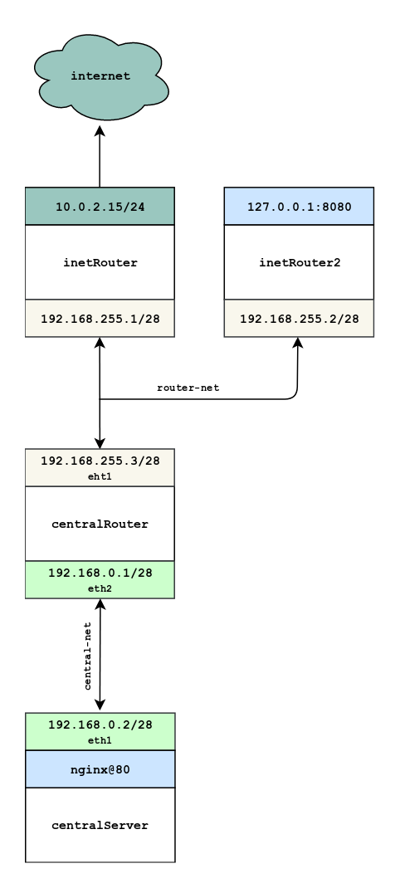

# Homework 13

## Фильтрация трафика
-------------
[Vagrantfile](./base_ospf/Vagrantfile) для задания.

<a href="https://raw.githubusercontent.com/reddare/otus-linux/master/hw14/hw14.png" rel="Click!"></a>
-------------
** Реализовать knocking port. centralRouter может попасть на ssh inetrRouter через knock скрипт.

**```Проверка:```**
**```1```**```vagrant ssh centralRouter```
**```2```**```for x in 8881 7777 9991; do sudo nmap -Pn --host_timeout 100 --max-retries 0 -p $x 192.168.255.1; done```
**```3```**```ssh vagrant@192.168.255.1```**```[пароль: vagrant]```**


for x in 8881 7777 9991; do sudo nmap -Pn --host_timeout 100 --max-retries 0 -p $x 192.168.255.1; done
ssh vagrant@192.168.255.1 (pass:vagrant):
