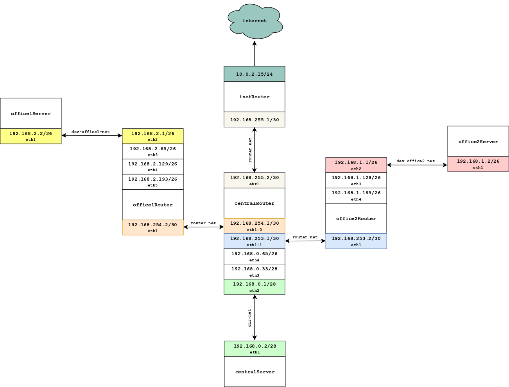

# Homework 9

## Архитектура сетей.

- Соединить офисы в сеть согласно схеме и настроить роутинг
- Все сервера и роутеры должны ходить в инет черз inetRouter
- Все сервера должны видеть друг друга
- У всех новых серверов отключить дефолт на нат (eth0), который вагрант поднимает для связи
- При нехватке сетевых интервейсов добавить по несколько адресов на интерфейс

Для успешного выполнения всех пунктов, была создана карта сети:

<a href="https://raw.githubusercontent.com/reddare/otus-linux/hw9/hw9/map-hw9.png" rel="Click!"></a>

Результат выполнения в [Vagrantfile](./Vagrantfile).

Все роутеры пришлось объеденить в одну физическую (virtualbox) сеть ```router-net```, в ином случае алиасы для ```eth1``` на ```centralRouter``` не работали.
